# Ứng Dụng Xem Phim Trực Tuyến

> Đồ án môn học **Lập Trình Trên Thiết Bị Di Động** – Trường Đại Học Điện Lực

---

## Giới thiệu

Ứng dụng xem phim trực tuyến trên thiết bị di động, cho phép người dùng duyệt, tìm kiếm, xem phim online, tải phim offline, quản lý danh sách yêu thích và đăng ký gói VIP.

Ứng dụng được thiết kế theo hướng hiện đại, giao diện thân thiện, trực quan và dễ sử dụng trên nền tảng di động.

---

## Danh sách thành viên

| STT | Họ và tên | MSSV | Nhiệm vụ |
|-----|-----------|------|----------|
| 1 | Nguyễn Ngọc Hiếu | — | Màn hình chi tiết & tích hợp: MovieDetail, SerialDetail, Trailer, MostPopularMovie, UpcomingMovie, Profile, EditProfile, PremiumAccount, PaymentMethod, PrivacyPolicy. Tích hợp dữ liệu & kiểm tra luồng điều hướng toàn bộ app |
| 2 | Đỗ Văn Đức | — | Logic & API: AsyncStorage, AuthContext (đăng nhập/đăng ký), DownloadContext, WishlistContext, Navigation (Stack & BottomTabs), Reset Password, tích hợp expo-image-picker |
| 3 | Trần Tuấn Phong | — | Giao diện & UI components: SplashScreen, Onboarding, Home, Search, Download, Wishlist, Genre & Categories, responsive styling |

- **Giảng viên hướng dẫn:** ThS. Cấn Đức Điệp
- **Ngành:** Công nghệ thông tin – **Chuyên ngành:** Công nghệ phần mềm
- **Lớp:** CNPM5 – **Khóa:** 2023–2028

---

## Công nghệ sử dụng

- **Framework:** React Native (Expo)
- **Ngôn ngữ:** JavaScript
- **Navigation:** React Navigation (Stack + Bottom Tabs)
- **State Management:** Context API (AuthContext, DownloadContext, WishlistContext)
- **Lưu trữ cục bộ:** AsyncStorage
- **Thư viện hỗ trợ:** expo-image-picker, expo-av (video player)
- **API:** TMDB API (The Movie Database)

---

## Hướng dẫn cài đặt

### Yêu cầu hệ thống

- Node.js >= 16.x
- npm hoặc yarn
- Expo CLI (`npm install -g expo-cli`)
- Android Studio / Xcode (hoặc Expo Go trên điện thoại)

### Các bước cài đặt

```bash
# 1. Clone repository
git clone https://github.com/<your-org>/DoAn_NhomXX_XemPhimTrucTuyen.git

# 2. Di chuyển vào thư mục dự án
cd DoAn_NhomXX_XemPhimTrucTuyen

# 3. Cài đặt các dependencies
npm install

# 4. Chạy ứng dụng
npx expo start
```

---

## ▶️ Hướng dẫn chạy project

```bash
# Chạy trên Android
npx expo start --android

# Chạy trên iOS
npx expo start --ios

# Chạy trên trình duyệt (web)
npx expo start --web
```

Hoặc quét QR code trong terminal bằng ứng dụng **Expo Go** trên điện thoại.

---

## Chức năng chính

- **Xác thực người dùng:** Đăng ký, đăng nhập, đặt lại mật khẩu
- **Trang chủ:** Danh sách phim nổi bật, phim sắp chiếu, phim phổ biến
- **Tìm kiếm:** Tìm kiếm phim theo tên, thể loại
- **Chi tiết phim:** Thông tin chi tiết, trailer, phim liên quan
- **Xem phim trực tuyến:** Phát video trực tiếp trong ứng dụng
- **Tải xuống offline:** Tải phim về xem khi không có mạng
- **Danh sách yêu thích:** Lưu và quản lý phim yêu thích
- **Gói VIP & Thanh toán:** Đăng ký tài khoản premium, chọn phương thức thanh toán
- **Hồ sơ cá nhân:** Xem và chỉnh sửa thông tin, đổi ảnh đại diện
- **Cài đặt:** Ngôn ngữ, thông báo, chính sách bảo mật

---

## 📸 Screenshots

### 🚀 Splash


### 👋 Onboarding
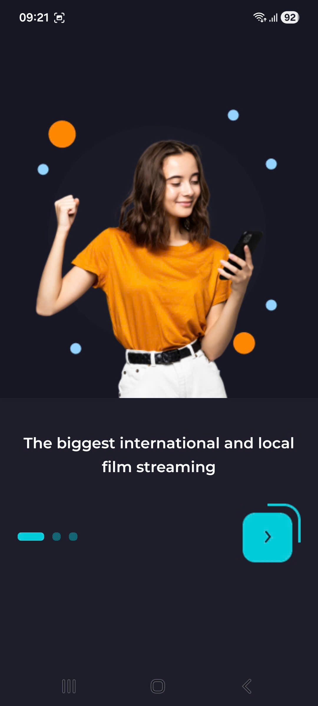

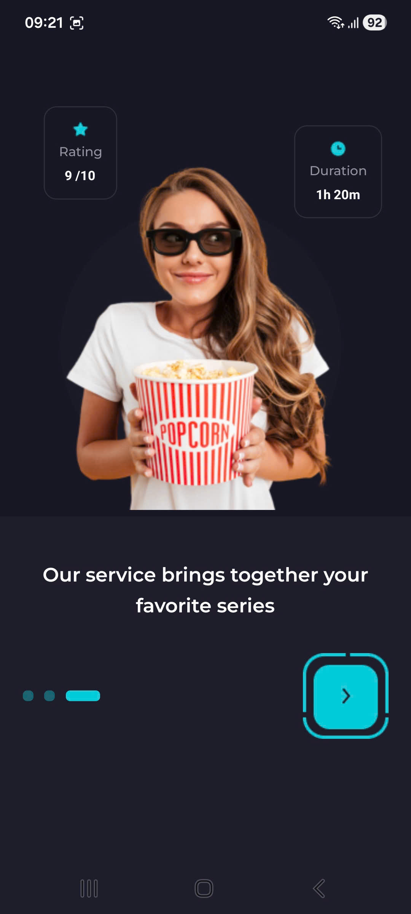

### 🔐 Authentication (Login / Signup)

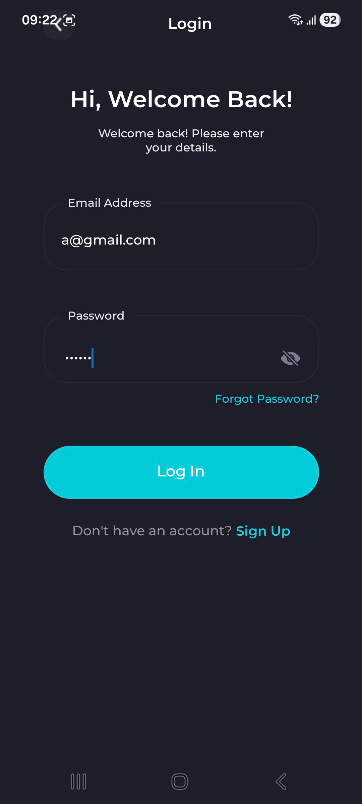
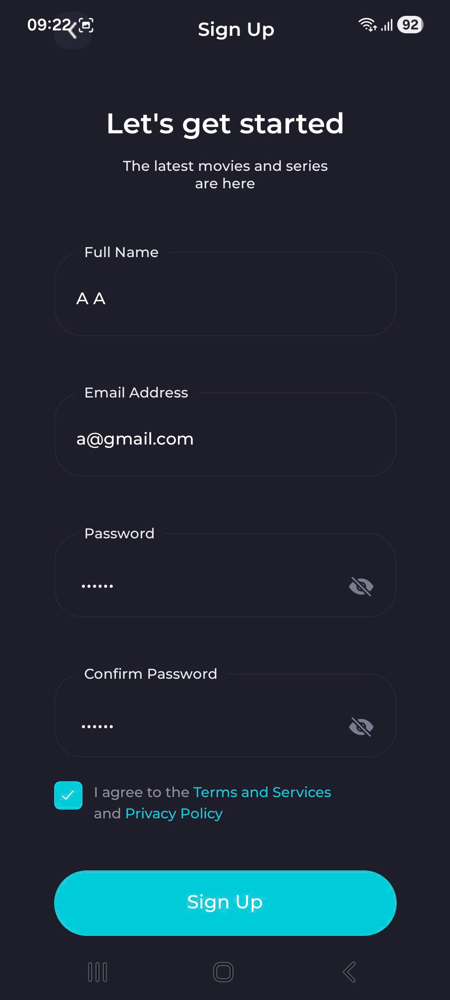

### 🏠 Home
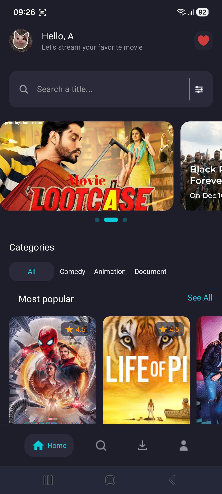

### 🔍 Search
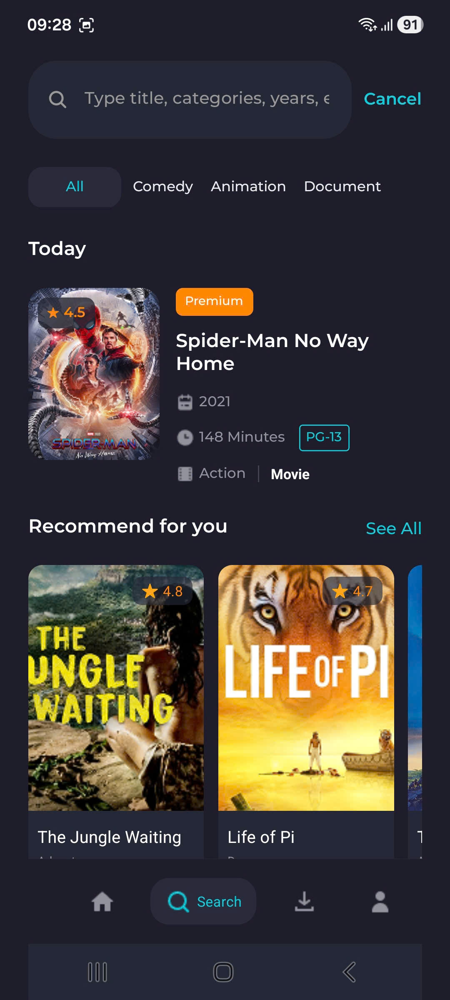

### 🎬 Genre
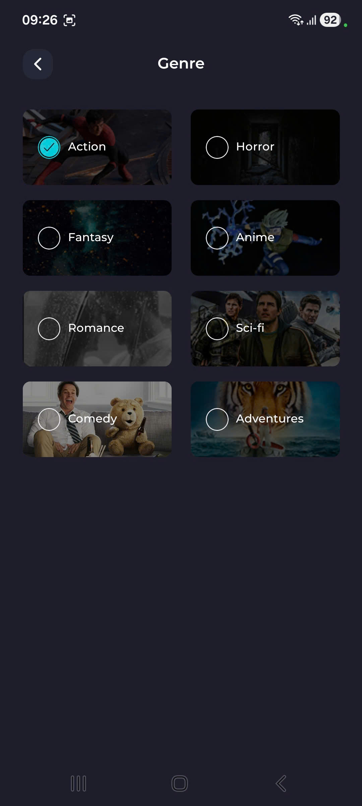

### 🔥 Popular
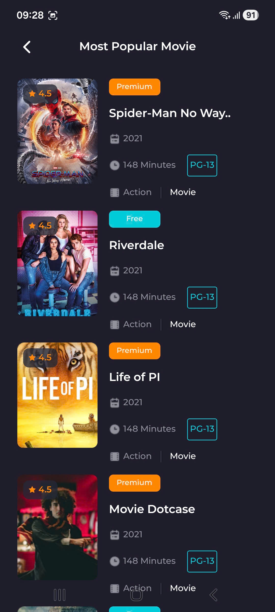

### ⏳ Upcoming
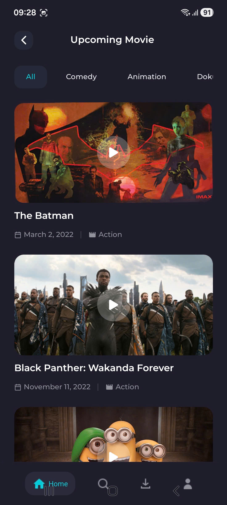

### 🌐 Language
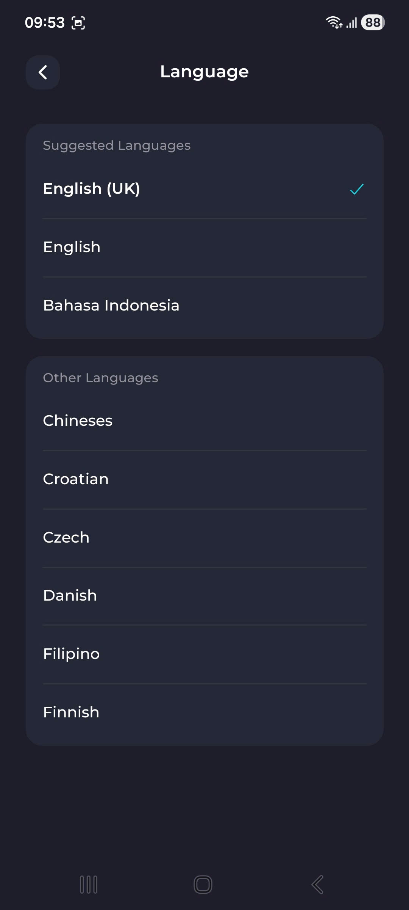

### 🎥 Movie Detail
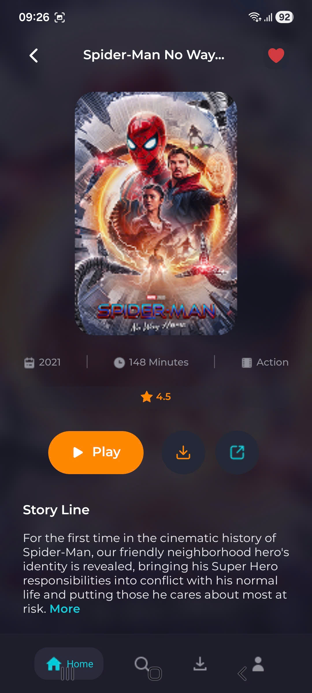

### ❤️ Wishlist
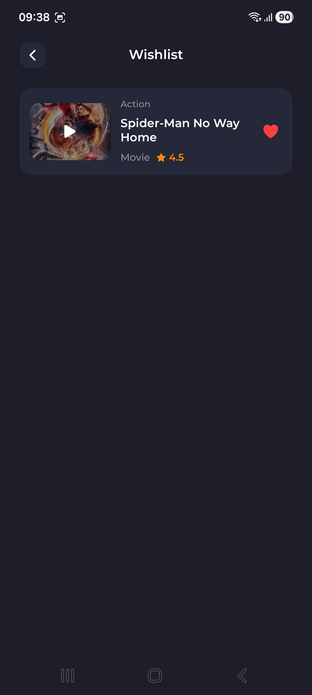

### ⬇️ Download
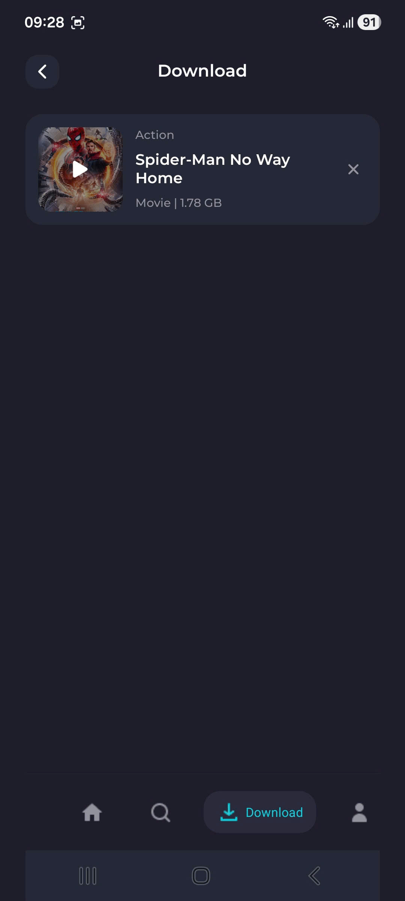

### ⚙️ Settings
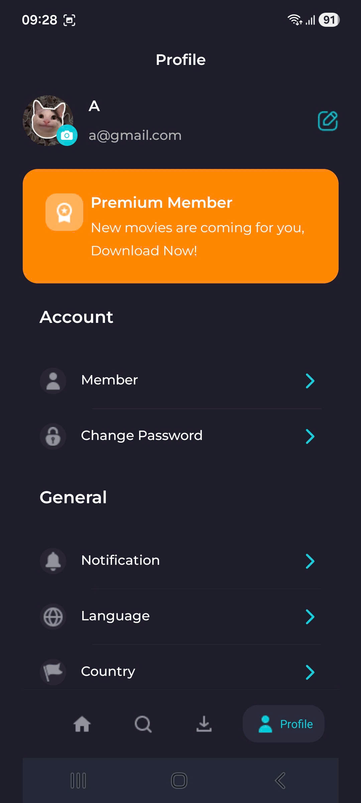
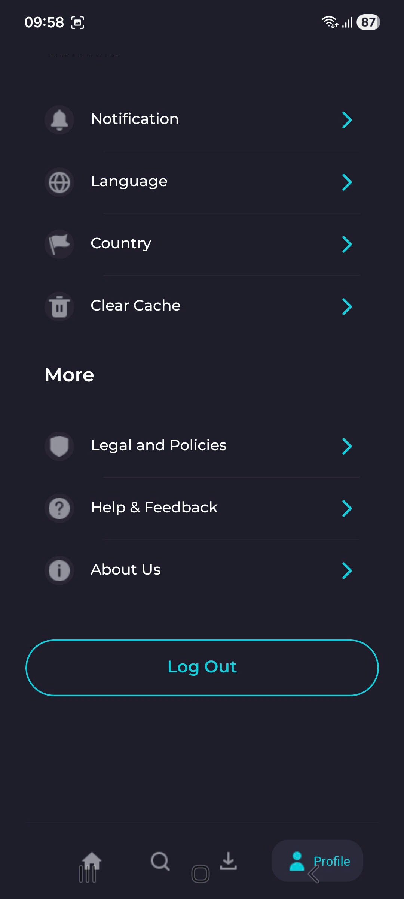

### 💳 Payment

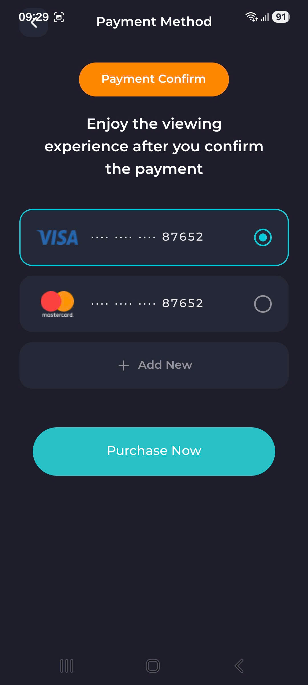
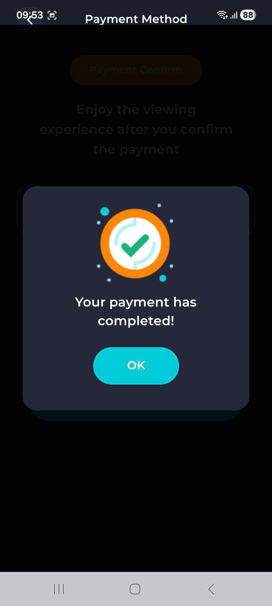

### 🔔 Notification
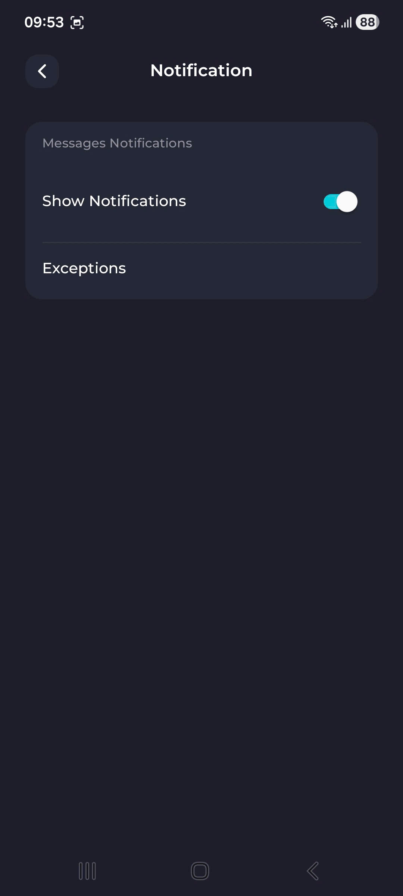

### 🔑 Reset Password

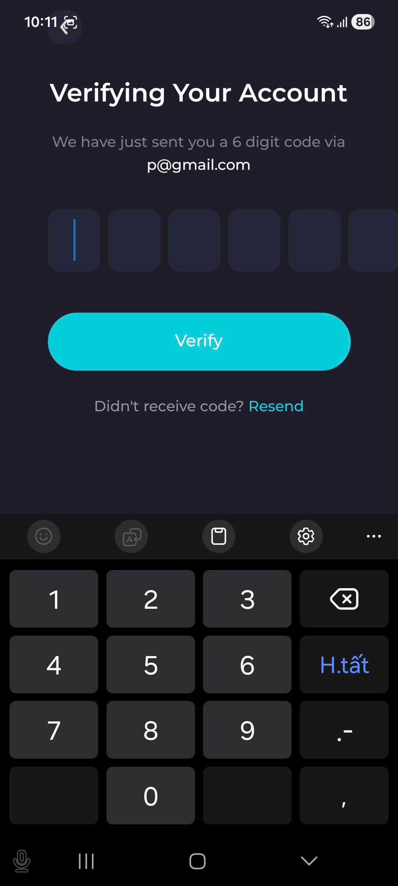
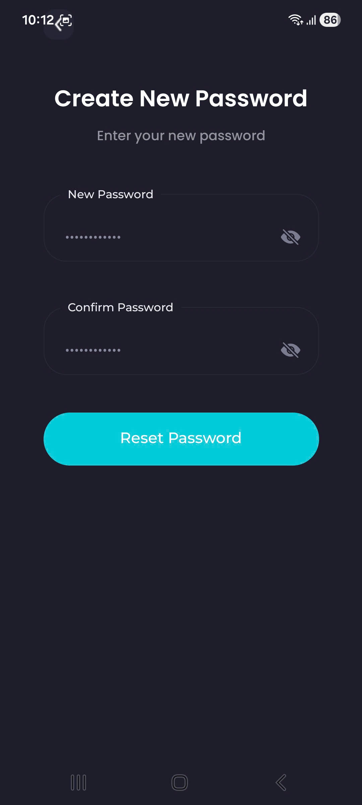

### 📜 Policy
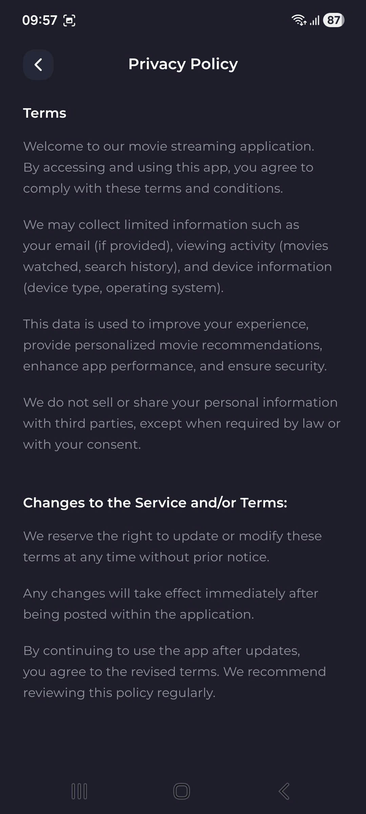

---

## Video demo

https://drive.google.com/file/d/12x-D5IIiWQNJTJSzlRAb5f_8tmh_xyNp/view?usp=sharing

---


## Phân công nhiệm vụ chi tiết

| Thành viên       | Phần phụ trách                                              | Mức độ đóng góp |
|------------------|-------------------------------------------------------------|-----------------|
| Nguyễn Ngọc Hiếu | UI màn hình chi tiết, tích hợp dữ liệu, kiểm tra điều hướng | ~34%            |
| Đỗ Văn Đức       | Logic xác thực, quản lý state, cấu hình navigation, API     | ~33%            |
| Trần Tuấn Phong  | UI components cơ bản, màn hình chính, responsive styling    | ~33%            |

---

## Tài liệu tham khảo

- Giáo trình bộ môn Lập trình thiết bị mobile – Trường Đại học Điện Lực
- [React Native Documentation](https://reactnative.dev/docs/getting-started)
- [Expo Documentation](https://docs.expo.dev/)
- [TMDB API Documentation](https://developer.themoviedb.org/docs)
- [React Navigation](https://reactnavigation.org/docs/getting-started)

---


